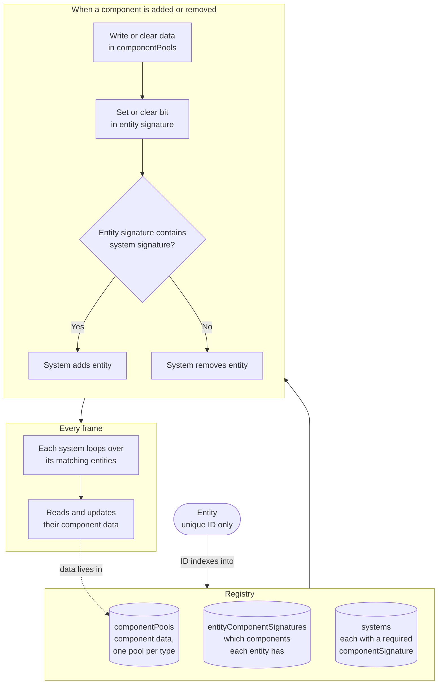

## 2D Game Engine Wireframe

## ECS Structure

The engine uses an Entity-Component-System (ECS) design:

- **Entity**: a unique ID with no data or behaviour
- **Component**: plain data (Transform, RigidBody, Sprite, …), stored in one pool per type
- **System**: logic that runs on every entity whose components match its signature

## Example layout

| Entity | Signature (T R S) | Transform    | RigidBody  | Sprite     |
| ------ | ----------------- | ------------ | ---------- | ---------- |
| 0      | `111`             | pos (10, 20) | vel (2, 0) | player.png |
| 1      | `101`             | pos (50, 80) | —          | tree.png   |
| 2      | `110`             | pos (0, 0)   | vel (0, 5) | —          |

`MovementSystem` requires Transform + RigidBody (`110`), so it processes entities 0 and 2.

## Project Status

> Version 1.0 is currently in progress.

## Credits

Thanks to **Gustavo Pezzi** for his online 2D game engine course at [Pikuma](https://pikuma.com).
